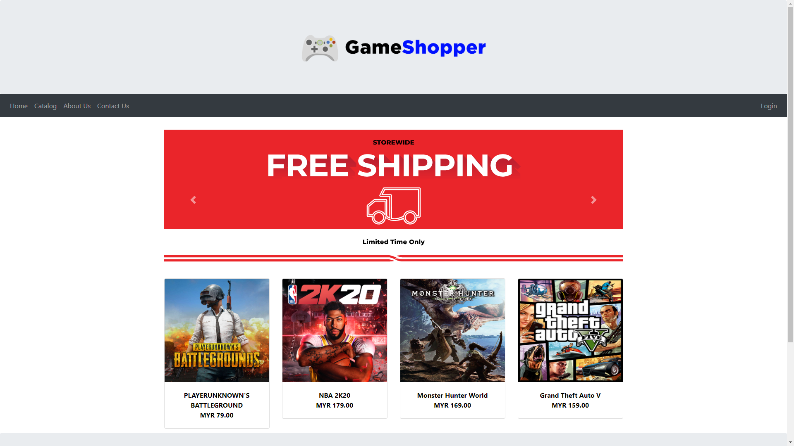

# GameShopper
Final year project for Diploma in Information Technology (2020)

## Introduction
This project is about an online game store which will be selling a wide range of games available for the main platform such as PC, PlayStation and X-BOX. Nowadays, users prefer to shop online as there will be less time wasted spent on driving, browsing and queueing at a retail store. So, our system will be a much more convenient choice for them.

Our platform requires the customers to create an account or login to their existing account before making purchases. When the customers register, they are needed to fill up their name, contact number and address. These credentials will be used later when they check out their purchases. Our platform will also feature a filter option so that our customers can browse our catalog for easily. As for the payment method, we opted to online payment method as it is easier for the customers to make payment without the needs to leave their house and it will be easier for us to verified the payment. We will also be providing a shipping services using national courier. After the customers complete their purchases, they can view their order history

## Project Objectives 
### To provide a platform for gamers that is user friendly for customers.
The platform will be fast loading and clean user interface. It will be very simple and straightforward on how to use/operate the website. Easy to find links. All the buttons and links will be clearly visible to avoid unnecessary click.
### To provide a cheaper option for users with more competitive pricing.
We aim to provide a more competitive price for our customers. We believe this will be achieved as we don’t have a physical store so our expenses will be reduced to a minimal.
###	To reduce customer time on shopping as they are not needed to leave the house.
With online shopping and online payment provided, customers shopping time will be significantly reduced. Customers wouldn’t need to leave their house and waste their time browsing the item in a physical store.

## Project Screenshots

## Link to Documentation

